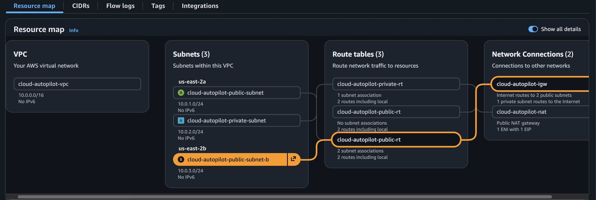
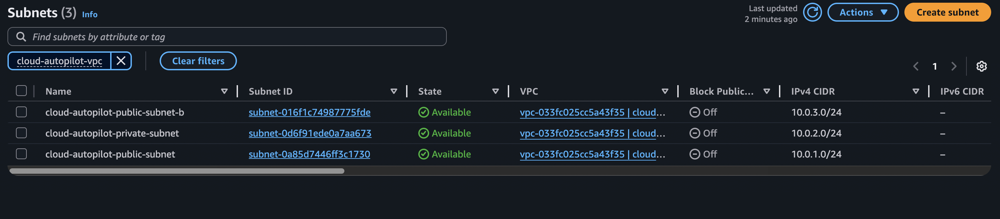
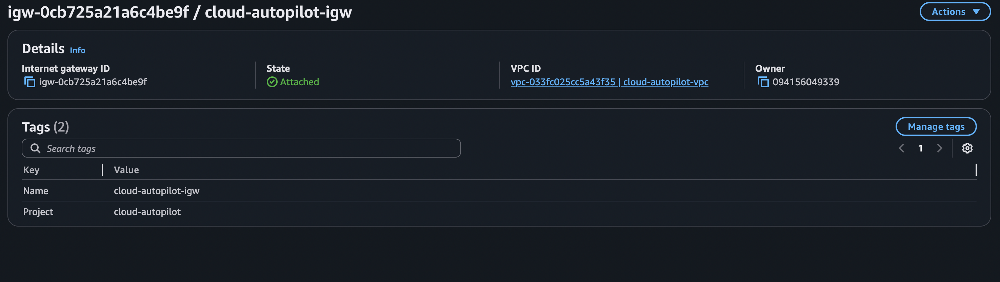
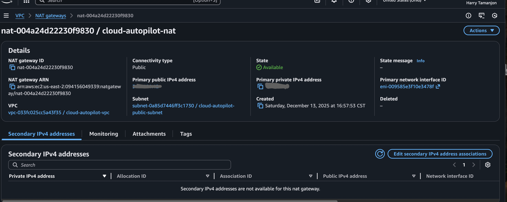
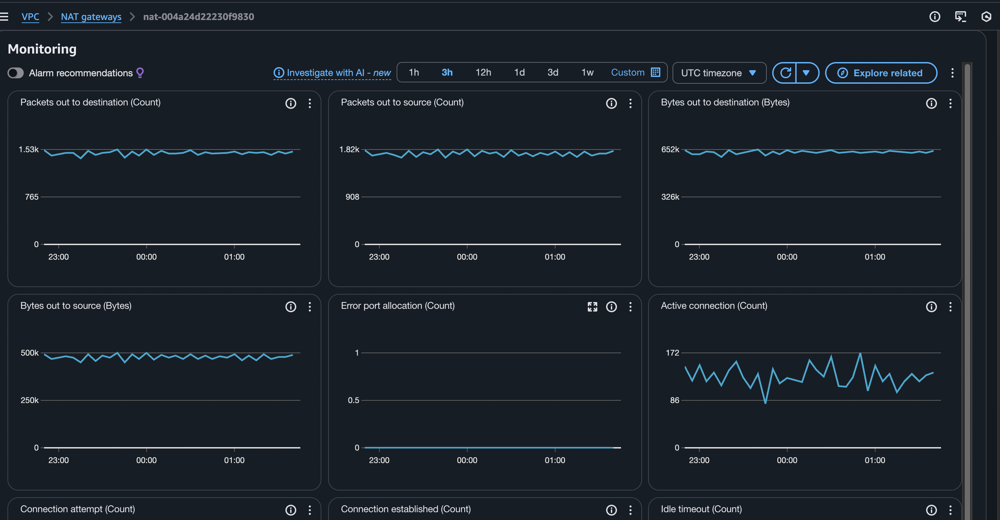
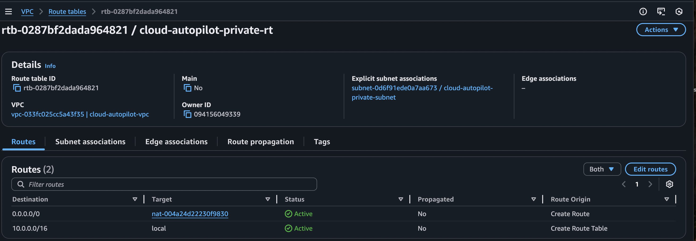
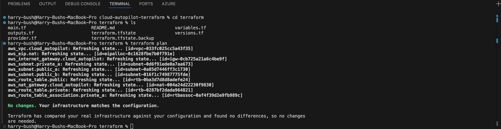

# Cloud Autopilot VPC — Terraform IaC

This project provisions a **production-ready AWS VPC** using Terraform, following AWS networking and Infrastructure-as-Code best practices.

---

## 🧱 Architecture Overview

- Custom VPC (`10.0.0.0/16`)
- Public and private subnets across Availability Zones
- Internet Gateway for public access
- NAT Gateway for private subnet egress
- Separate public and private route tables
- Explicit subnet-to-route-table associations
- Fully managed via Terraform (IaC)

---

## ☁️ AWS Resources Provisioned

- VPC
- Public & Private Subnets
- Internet Gateway
- NAT Gateway + Elastic IP
- Public & Private Route Tables
- Route Table Associations

---

## 🛠 Terraform Highlights

- Clean, readable Terraform configuration
- Explicit routing (no implicit defaults)
- Fully tagged resources for clarity and cost tracking
- `terraform plan` confirms **zero drift**
- Terraform state fully reconciled with AWS resources

---

## 🚀 How to Use

```bash
terraform init
terraform plan
terraform apply
---

## 📸 Architecture & Proof of Implementation

### VPC Architecture Overview


**Highlights**
- Dedicated production VPC (`10.0.0.0/16`)
- Public and private subnets across multiple AZs
- Internet Gateway + NAT Gateway separation
- Clean, explicit routing

---

### Subnet Design (Public vs Private)


---

### Route Tables & Clean Routing


---

### Internet Gateway


---

### NAT Gateway Configuration


---

### NAT Gateway Monitoring


---

### Private Route Table → NAT Gateway


---

### Terraform Plan Validation (Drift-Free)


**Result**
- No drift detected
- Infrastructure fully managed by Terraform
- State matches real AWS resources